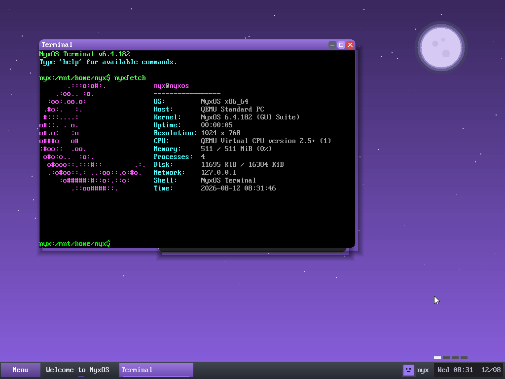

  

<strong>The windowing compositor of NyxOS — the purple night-themed desktop, drawn from scratch.</strong>

  
  &nbsp;
  
  &nbsp;
  
  &nbsp;
  

---

## About

**Hemera** — named for the primordial goddess of *day*, born of Nyx — is the desktop of NyxOS: the compositor that turns a raw framebuffer into a windowed environment. It draws every pixel itself, with no toolkit underneath.

It is **double-buffered** (each frame is composed off-screen and blitted in one shot, so there is never a half-drawn frame), and it owns the whole desktop: overlapping windows with drag, resize, minimise/maximise and z-order; a taskbar and a searchable start menu; desktop icons; a right-click context menu; an animated night-sky wallpaper; a screensaver; and even MouseKeys, so the pointer can be driven from the keyboard on hardware with no mouse.

  
  
<em>The NyxOS desktop composed by Hemera — windows, taskbar, start menu and the night-sky wallpaper</em>

## Features

- **Compositor** — off-screen back buffer + single-blit present (flicker-free); dirty-rect redraw; idle-yield so it doesn't busy-poll
- **Window system** — create/destroy, move, resize, minimise/maximise, focus and z-order; per-window draw / key / click callbacks
- **Shell** — taskbar with live task buttons and a clock; a start menu with type-to-search; draggable desktop icons; a context menu
- **Look** — a purple night theme, an animated starfield-and-moon wallpaper, and a boot splash
- **Input** — mouse, scroll wheel, and keyboard-driven MouseKeys for mouse-less machines
- **3D** — a small software rasteriser (`tri.c` / `mat4.c`) for the perspective HUDs and voxel demos

## Architecture

Hemera is the desktop layer of **[NyxOS](https://github.com/nyxos-dev/nyx-os)**. Today it is compiled into the kernel under `kernel/gui/core/` and runs in ring 0; the next step is to graduate it into a standalone ring-3 ELF that talks to the kernel purely through the window syscalls. This repository holds a source snapshot (`src/`) of that component.

The apps that live *on top* of Hemera are their own components, each named for a deity of the night:

| Component | Repo | Role |
|-----------|------|------|
| **Hemera** | *(here)* | the compositor / desktop |
| **Erebus** | [erebus](https://github.com/nyxos-dev/erebus) | the terminal |
| **Selene** | [selene](https://github.com/nyxos-dev/selene) | the web browser |
| **Mnemosyne** | [mnemosyne](https://github.com/nyxos-dev/mnemosyne) | the text editor |

## Layout

- `src/compositor.c` — the compositor and window manager (the heart of Hemera)
- `src/gui.c`, `src/theme.h`, `src/gfx_prims.h` — drawing primitives and the night theme
- `src/wallpaper_win.c`, `src/bootsplash.c` — the animated wallpaper and boot splash
- `src/tri.c`, `src/mat4.c` — the software 3D rasteriser
- `src/userwin.c` — the ring-3 window registry (windows opened by user ELFs)

## Status

Built into the NyxOS kernel and running the desktop today; the standalone-ELF split is the roadmap.
